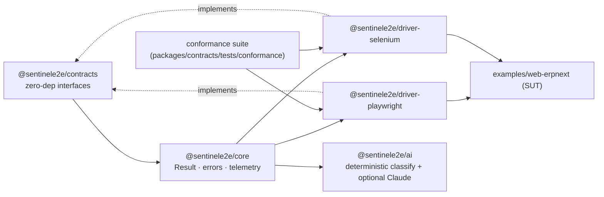

# Sentinel

   

Sentinel is an automation framework built around one core idea: every action in a run produces a clean, structured, domain-level **telemetry record**, and AI reasons over that record to explain runs and classify failures as real-bug, infra-flake, or selector-drift.

Tool-agnosticism is a consequence of honest plugin seams — driver contracts, locator-strategy registry, telemetry sinks — not the headline. A second driver implements the same contracts without touching framework or flow code: the Selenium driver is already proof, and a mobile driver (Appium) would slot in the same way.

Slices **A** (the spine plus the Playwright driver), **B** (the `@sentinele2e/ai` run-analyzer), **C** (a second web driver plus a shared cross-driver conformance suite), and **F** (the `@sentinele2e/dashboard` operator dashboard, wired into `sentinel report --html`/`--serve`) are all built and merged. It is a working monorepo with six framework packages and one example app. Tool-agnosticism is now demonstrated, not just designed: two maximally-different web drivers pass one conformance suite and emit schema-identical telemetry. Features not yet built are listed under [Roadmap](#roadmap).

## Architecture at a glance



`@sentinele2e/contracts` has zero runtime dependencies; every driver and flow codes against it. `@sentinele2e/core` adds the `Result` model, error taxonomy, and telemetry pipeline. `@sentinele2e/driver-playwright` and `@sentinele2e/driver-selenium` are the only packages that import their respective browser SDKs; both implement the same contracts and feed one shared conformance suite. `@sentinele2e/ai` reads run telemetry and never imports a driver.

---

## What is built today

### `@sentinele2e/contracts`

Zero runtime dependencies. Pure TypeScript interfaces that every driver and flow codes against:

- `Driver` / `Session` / `SessionConfig` — the factory contract; sessions declare capabilities up-front. `SessionConfig` carries `defaultTimeoutMs` (the single timeout source of truth) plus two driver-opaque adoption seams: `existingPage` (the page-wrap path) and the generic `existingSession?` (a pre-built handle a driver may adopt, e.g. a Selenium `WebDriver`; Appium-ready).
- `Locator` / `LocatorStrategy` — an ordered, lazily-resolved description (never a live DOM handle); `logicalName` is the stable drift anchor. `within` (scoping/chaining) is optional — a driver implements it only where it can.
- `Action` — universal verbs (`tap`, `typeText`, `clear`, `read`), each taking an optional `ActionOptions{ timeoutMs }`; mobile-only gestures (`swipe`, `longPress`, `scrollTo`) are optional and capability-gated. A per-action `timeoutMs` may only _tighten_ the deadline: the effective bound is `min(timeoutMs, SessionConfig.defaultTimeoutMs)`. Auto-wait drivers honour it by passing `{ timeout }` to the SDK; no-auto-wait drivers honour it by polling to that deadline.
- `Assertion` — `waitFor` and `waitForFirstOf`; both throw on timeout, never resolve silently.
- `Capability` / `CapabilityProbe` — typed gates for web-only (`navigation`, `dom`, `accessibilityTree`) and mobile-only (`gestures`, `contexts`) features.
- `TelemetrySinkLike` — a minimal structural interface so `@sentinele2e/contracts` stays dependency-free while still carrying a sink reference on `Session`.

### `@sentinele2e/core`

Runtime utilities that all framework packages and flows use. Depends only on `@sentinele2e/contracts`.

**Result model.** A discriminated-union `Result<T, R, D>` with two variants:

```ts
// status: "success"
{ status: "success"; data: T; meta: ResultMeta }

// status: "business-failure"
{ status: "business-failure"; reason: R; message?: string; details?: D; meta: ResultMeta }
```

`ResultMeta` carries `correlationId` (the join key tying the result to every telemetry event in the run), `flowName`, `startedAt`, and `durationMs`. Factory helpers `ok(data, meta)` and `businessFailure(reason, meta, opts)` build the two variants. Business failures are returned; system failures are thrown.

**Error taxonomy.** `SystemFailureError` is the abstract base for typed thrown errors. Concrete subclasses:

| Class                          | `kind`                       | `retryable` |
| ------------------------------ | ---------------------------- | ----------- |
| `TimeoutError`                 | `"timeout"`                  | true        |
| `SelectorNotFoundError`        | `"selector-not-found"`       | false       |
| `SelectorAmbiguousError`       | `"selector-ambiguous"`       | false       |
| `DriverSessionError`           | `"driver-session"`           | true        |
| `AssertionInfrastructureError` | `"assertion-infrastructure"` | false       |
| `CapabilityUnsupportedError`   | `"capability-unsupported"`   | false       |

Each error carries a `SystemFailureContext` with `correlationId`, `flowName`, `startedAt`, `durationMs`, optional artifacts, and context fields specific to the error kind (e.g. `branchProgress` for `TimeoutError` on a `waitForFirstOf` call).

**Telemetry.** A sink pipeline with clear responsibilities:

- `SpanContext` — owns the monotonic sequence counter and mints span IDs for a run; shared across the whole trace.
- `StampingSink` — the single place stamping happens (applies `traceId`, `spanId`, `parentSpanId`, `sequence` from the `SpanContext`) before delegating to the inner sink.
- `InMemorySink` — pure recorder; children share the same backing array (one flat event log per run).
- `JsonlSink` — appends `JSON.stringify(event)\n` to a file; never throws (best-effort; telemetry must not fail a run).
- `CompositeSink` — fans events to multiple sinks; children propagate.
- `NoopSink` — discards all events; used in tests that do not care about telemetry.

**Locator strategy registry.** `StrategyRegistry` maintains durability ranks for strategy kinds (role=0, label=1, text=2, placeholder/altText/title=3, testid=4, relative=5, css/xpath=6). Drivers resolve candidates in declaration order and record each candidate's outcome (`matched` / `missed` / `skipped`). Selector drift is when a more-durable candidate was tried-and-`missed` _below_ the winning rank — not merely `skipped` because the driver doesn't support that kind.

### `@sentinele2e/driver-playwright`

The only package that imports `@playwright/test` (now declared as a **`peerDependency`**, with a dev-dependency for local builds/tests). Implements the contracts for Playwright:

- `PlaywrightDriver` — implements `Driver`; declares capabilities (`navigation`, `dom`, `accessibilityTree`, `screenshot`) and supported strategy kinds (`role`, `label`, `text`, `testid`, `css`, `xpath`). It requires a pre-navigated `Page` via `SessionConfig.existingPage` (duck-typed; throws `DriverSessionError` on mismatch). This is the single guarded `as Page` narrowing point.
- `PlaywrightSession` — wraps the `Page`; creates a `SpanContext` keyed on `session.id` and wraps the supplied sink in a `StampingSink`, so `session.id == traceId == correlationId == JSONL filename` throughout the run.
- `PlaywrightResolver` — walks `locator.candidates` in declaration order using the `StrategyRegistry` rank table; emits a `locator.resolved` event before returning the handle. A more-durable candidate tried-and-missed below the winner is the selector-drift signal (see [Telemetry](#telemetry)).
- `PlaywrightAction` — implements `tap`, `typeText`, `clear`, `read` via the resolver. Each verb clamps the effective Playwright timeout to `min(opts.timeoutMs, defaultTimeoutMs)`, so callers can only tighten the session bound.
- `PlaywrightAssertion` — implements `waitFor` and `waitForFirstOf`. `waitForFirstOf` runs all branches concurrently in short poll slices (a shared winner latch cancels losers without unhandled rejections). On no winner it emits an `assertion` event with the per-branch `BranchProgress` and throws `TimeoutError`. It never resolves on timeout.

### `@sentinele2e/driver-selenium`

The second web driver, and the only package that imports `selenium-webdriver`. It implements the **same contracts** as the Playwright driver over a maximally-different tool, proving the seams are honest:

- `SeleniumDriver` — implements `Driver`; declares capabilities (`navigation`, `dom`, `screenshot` — **no** `accessibilityTree`) and supported strategy kinds (`css`, `xpath`, `testid`, `text`, `label`, `placeholder`, `altText`, `title`). It honestly does **not** advertise `role` (which needs an a11y-tree shim) or `relative`. It adopts a pre-built Selenium `WebDriver` via `SessionConfig.existingSession` (falling back to `existingPage`), duck-typed at the single narrowing point; throws `DriverSessionError` on mismatch.
- `compileStrategy` — a pure, browser-free compiler that maps each supported `LocatorStrategy` kind to a Selenium `By` descriptor (`css`/`testid`/`placeholder`/`title`/`altText` to CSS selectors, `text`/`label` to XPath unions, with exact/substring matching and proper XPath-literal escaping). Unsupported kinds (`role`, `relative`) are not compilable and are **skipped** during resolution, not failed.
- No auto-wait: actions poll to an explicit deadline (clamped to `defaultTimeoutMs`) before performing the verb — the contract's actionability guarantee implemented by hand rather than inherited from the SDK.
- Resolution falls through unsupported candidates to a `css`/`xpath` candidate, and emits **schema-identical** telemetry: a `role`-first + `css`-fallback locator resolves via `css` with `degraded: false` (the `role` candidate is recorded as `skipped`, never `missed`), so a css/xpath-native driver does not false-flag every run as drifting.

### Proving tool-agnosticism (conformance suite)

A single, shared cross-driver conformance suite lives at `packages/contracts/tests/conformance/`. `harness.ts` is a parameterized factory (`defineDriverContract`) that imports **only** the test runner and the contracts/core types — never a driver SDK. Each driver supplies a thin adapter (`playwright.contract.test.ts`, `selenium.contract.test.ts`) that owns its SDK import and a `DriverHarness`, then hands it to the same factory.

Both drivers run the identical assertions: resolver-emits-before-handle, the drift fix (unsupported top candidate => `skipped` + `degraded:false`; a supported candidate missed below the winner => `degraded:true`), `waitFor`/`waitForFirstOf` totality (throw `TimeoutError`, carry `BranchProgress[]`), action round-trips, per-action timeout clamping, capability honesty, and — critically — an exact **schema-identity** check on `locator.resolved` and `assertion` events. Passing one suite with one schema across two unrelated tools is the concrete proof that tool-agnosticism is real, not aspirational.

The Playwright adapter always runs (the test runner already provisions a browser). The Selenium adapter is **gated** behind `SENTINEL_SELENIUM=1` (Selenium Manager provisions chromedriver on first run); offline it skips cleanly.

### `@sentinele2e/ai`

The run-analyzer (Slice B). Driver-agnostic — it depends only on the `@sentinele2e/core` telemetry contract and never imports a driver (enforced by the lint boundary). It reads a run's JSONL telemetry and classifies each failure deterministically, optionally using Claude to explain the run.

- `classify(events)` — a pure, deterministic rule engine that turns telemetry into `Verdict`s: `selector-drift` (a `locator.resolved` where a more-durable candidate was tried-and-`missed` _below_ the winning rank — derived purely from `candidates[].outcome`, so an unsupported/`skipped` top candidate never counts), `real-bug` (a rank-0 assertion that never matched, with no preceding retry), `infra-flake` (retry-then-pass, or a retryable timeout), `business-outcome` (an expected domain result like `INVALID_CREDENTIALS` — not a defect), `healthy`, or `indeterminate`. This drift definition is what lets the css/xpath-native Selenium driver run without false drift on every locator.
- `analyzeRun(jsonlPathOrEvents, opts)` — orchestrates load → classify → (optional) LLM → `RunAnalysis`. The LLM layer is **optional and graceful**: with no `ANTHROPIC_API_KEY` it returns a complete rules-only analysis; when a key is present it adds a plain-language explanation and adjudicates only the `indeterminate` cases (it never overrides a rule verdict). The provider sits behind an `LlmProvider` abstraction — a `FakeLlmProvider` for tests, and a lazily-loaded `ClaudeProvider` (`claude-opus-4-8`, prompt caching, forced tool-use). The SDK never loads on the rules-only path.
- `redactEvents` scrubs secrets — both values under secret-looking keys and secret-shaped values (JWTs, `Bearer` tokens, `sk-`/`ghp_`/`xox*`/`AKIA` key prefixes) — from everything sent to the API, while preserving UUID join-keys. The classification is also routed through redaction before it leaves the process.
- `sentinel-analyze <run.jsonl> [--json]` (root script: `npm run analyze`) — prints the analysis and exits non-zero only on a `real-bug` verdict.

### `@sentinele2e/dashboard`

The operator dashboard (Slice F). A **pure, offline, self-contained HTML generator** over run telemetry — no browser, no CDN, no server required to view it. It depends only on the `@sentinele2e/ai` barrel and `@sentinele2e/core`; the LLM SDK stays lazy (it is in the transitive _install_ tree via `@sentinele2e/ai`, but is never _imported_ on the default rules-only path).

- `buildDashboardModel(dir, opts)` — aggregates `buildReport(dir)` (rules-only, network-free) plus per-run drill-down detail built from `redactEvents(events)` → `classify(redacted)`, a `sequence`-ordered timeline (axis = numeric `startWallClockMs`/`durationMs` only), and a derived `startedAt` so runs are time-ordered, not filename-ordered. `--explain` is opt-in LLM prose (per-run `analyzeRun`, may hit the network/cost when `ANTHROPIC_API_KEY` is set; redacted again via `redactText` before embedding).
- `generateDashboard(model, opts): string` — a **pure** renderer (no fs, no net): a totals strip (run-level), a runs table with verdict chips, a drifting-locators section, and per-run timeline/verdicts/explanation drill-downs. Every interpolated telemetry string is HTML-escaped; the embedded JSON model is emitted in one `<script id="sentinel-data" type="application/json">` island guarded against `</script>` breakout.
- `serveDashboard(html | model, { port, auth? })` — an optional **`node:http`-only** (zero-dependency) server bound to **`127.0.0.1`** (loopback) that serves the generated HTML at `/`. When `auth` (`{user, pass}`) is supplied it requires **HTTP Basic Auth** (`401` + `WWW-Authenticate: Basic realm="Sentinel Dashboard"` on a miss/absence); without `auth` it serves openly. This is a local-operator convenience, not a network service.
- `sentinel report [dir] --html <out>` writes a self-contained dashboard (exits non-zero on a `real-bug`, like the text/json paths); `--serve [--port <n>] [--auth user:pass]` starts the loopback server (long-running; Ctrl-C to stop). `--json` and `--html` are mutually exclusive.

**Two limitations are documented, not hidden:**

- **Redaction is value-shape-narrow.** `redactEvents` scrubs secret-_named_ keys and unambiguous secret _shapes_ (JWT / `Bearer` / `sk-` / `ghp_` / `xox*-` / `AKIA`), deliberately so UUID join-keys, CSS selectors and prose survive. A plaintext secret in a free-text field (e.g. `system.failure.message`) that matches **no** known shape and sits under a non-secret key **survives** the scrub. Generic high-entropy detection is intentionally not done (it would nuke UUIDs). HTML-escaping on output is a separate, always-on control.
- **Per-run timelines are truncated.** Each run's timeline is capped at `--max-events` (default 500) with a visible "showing first N of M" note. Pagination/virtualization is deferred.
- **`--serve` is loopback-only.** It binds `127.0.0.1` and `--auth` (HTTP Basic Auth) is **optional** — do not expose it to an untrusted network.

### `examples/web-erpnext` (`@sentinele2e/example-web-erpnext`)

A private example app demonstrating the auth slice on the contracts. It is not a framework package; it is the reference SUT (system under test).

- `logIn(page, credentials, opts)` (`src/flows/auth/log-in.ts`) — the top-level flow function. Builds a session, fills and submits the login form, and races two locator branches via `session.assert.waitForFirstOf`: `INVALID` (the `.page-card-body.invalid` structural state or the invalid-message text) vs `SUCCESS` (the `div.desktop-wrapper` app shell). Returns a `LoginResult` (a `Result<LoginSuccessData, "INVALID_CREDENTIALS", LoginFailureDetails>`).
- The `runId` is minted before the session is created, so `runId == session.id == correlationId == traceId == JSONL filename`. Telemetry is written to `test-results/telemetry/<runId>.jsonl` via a `CompositeSink([InMemorySink, JsonlSink])`.
- Session creation is injectable via `opts.createSession` (default: `PlaywrightDriver.createSession`, the page-wrap path). This is the seam the cross-driver proof uses.
- Locators in `domain/auth/locators.ts` each carry multiple ordered candidates (most-durable first, CSS fallback last), satisfying the `Locator` contract.
- **Tool-agnosticism proof** (`tests/auth/log-in.selenium.test.ts`, gated on `SENTINEL_SELENIUM=1`): the **unchanged** `logIn` flow runs on a Selenium-backed session via `opts.createSession` — the `page` arg is passed `undefined` and ignored, while a real Selenium `WebDriver` is adopted via `existingSession`. It runs **offline** against `data:` HTML fixtures (no live app), asserts the rich `LoginResult`, and confirms `classify()` agrees on the same emitted telemetry — including that the submit locator does not false-drift (its `role` candidate is `skipped`, not `missed`).

---

## The Result model

Business failures are returned as a `Result`; system failures are thrown as typed `SystemFailureError` subclasses. This keeps the happy path and expected-failure path in the type system while letting real infra/driver failures propagate as errors.

```ts
import type { Result } from "@sentinele2e/core";

// Checking the outcome
if (result.status === "success") {
  console.log(result.data.username, result.data.finalUrl);
} else {
  // result.status === "business-failure"
  console.log(result.reason); // "INVALID_CREDENTIALS" — stable, never localized
  console.log(result.message); // optional localized UI text
  console.log(result.meta.correlationId); // join key into the JSONL telemetry file
}
```

`ResultMeta.correlationId` is the single join key: it equals `Session.id`, every telemetry event's `traceId`, and the JSONL filename.

---

## Telemetry

Every resolved locator and every assertion emits a structured event. Both drivers emit this **identical schema** (enforced by the conformance suite's schema-identity checks). The event types:

| Event type          | When emitted                              | Key fields                                                                                                                                                                                 |
| ------------------- | ----------------------------------------- | ------------------------------------------------------------------------------------------------------------------------------------------------------------------------------------------ |
| `locator.resolved`  | Each resolver call                        | `logicalName`, `resolvedKind`, `resolvedRank`, `degraded` (a more-durable candidate was `missed` below the winner), `candidates[]` with per-outcome (`matched`/`missed`/`skipped`) records |
| `assertion`         | Each `waitFor` / `waitForFirstOf` outcome | `state`, `matched`, `locatorRank`, `branchProgress[]`                                                                                                                                      |
| `business.failure`  | When a flow returns a business failure    | `domainReason` (stable, e.g. `"INVALID_CREDENTIALS"`)                                                                                                                                      |
| `flow.finished`     | At flow exit                              | `outcome`, `terminalReason`, `didDegrade`                                                                                                                                                  |
| `system.failure`    | On thrown `SystemFailureError`            | `errorKind`, `retryable`, `artifactRefs[]`                                                                                                                                                 |
| `retry`             | On retry                                  | `attempt`, `maxAttempts`, `previousOutcome`                                                                                                                                                |
| `artifact.captured` | On artifact attach                        | `artifactKind`, `ref`, `capturedOn`                                                                                                                                                        |

Every event envelope carries `schemaVersion`, `eventId`, `type`, `traceId`, `spanId`, `parentSpanId`, and `sequence`. Stamping happens once in `StampingSink` before fan-out, so the in-memory log and the on-disk JSONL are always identical.

The `CompositeSink([InMemorySink, JsonlSink])` setup in the example app writes one JSONL file per run at `test-results/telemetry/<runId>.jsonl`. This file is the feed consumed by the `@sentinele2e/ai` run-analyzer (above) — `npm run analyze test-results/telemetry/<runId>.jsonl`.

---

## Getting started

### Prerequisites

- Node.js 20+
- A running ERPNext instance (only needed for the e2e spec)

### Install

```
npm install
npx playwright install chromium
```

### Environment variables (e2e spec only)

```
BASE_URL=https://your-erpnext-instance
ADMIN_USER=Administrator
ADMIN_PASSWORD=your-password
```

These are required by `examples/web-erpnext/src/config/env.ts`. The unit tests do not need them.

### Scripts

All scripts are defined in the root `package.json`.

| Script                 | What it does                                                                             | Needs live app?  |
| ---------------------- | ---------------------------------------------------------------------------------------- | ---------------- |
| `npm run typecheck`    | `tsc -b` solution build across all packages                                              | No               |
| `npm run lint`         | ESLint with `--max-warnings=0`                                                           | No               |
| `npm run lint:fix`     | ESLint with auto-fix                                                                     | No               |
| `npm run format`       | Prettier write                                                                           | No               |
| `npm run format:check` | Prettier check                                                                           | No               |
| `npm run analyze`      | `tsc -b` then the `sentinel-analyze` CLI (`node packages/ai/dist/cli.js <run.jsonl>`)    | No               |
| `npm run test:unit`    | Playwright runner on `playwright.unit.config.ts` — unit and browser tests, no app needed | No               |
| `npm test`             | Playwright e2e spec against ERPNext (`examples/web-erpnext/playwright.config.ts`)        | Yes              |
| `npm run test:all`     | `test:unit` then `test`                                                                  | Yes (for `test`) |
| `npm run test:headed`  | e2e spec in headed mode                                                                  | Yes              |
| `npm run test:ui`      | e2e spec in Playwright UI mode                                                           | Yes              |

`npm run test:unit` runs **offline** by default: the always-on Playwright driver and Playwright conformance tests run against a local Chromium, while the browser-backed Selenium driver and Selenium conformance tests **skip cleanly**. To run those Selenium/conformance browser tests, set `SENTINEL_SELENIUM=1` (Selenium Manager provisions a matching chromedriver on first run):

```
SENTINEL_SELENIUM=1 npm run test:unit
```

CI (`.github/workflows/ci.yml`) mirrors this: an always-on, required `typecheck` + `lint` + `test:unit` job (with Chromium installed), plus an opt-in, **non-blocking** job that re-runs `test:unit` with `SENTINEL_SELENIUM=1`.

---

## Repository layout

```
sentinel-e2e/
  packages/
    contracts/        @sentinele2e/contracts — zero-dep types
      tests/conformance/  shared cross-driver conformance suite (factory + per-driver adapters)
    core/             @sentinele2e/core — result, errors, telemetry, locator registry
    driver-playwright/ @sentinele2e/driver-playwright — Playwright adapter
    driver-selenium/  @sentinele2e/driver-selenium — Selenium adapter (same contracts)
    ai/               @sentinele2e/ai — run-analyzer (deterministic rules + optional Claude)
  examples/
    web-erpnext/      @sentinele2e/example-web-erpnext — auth slice on ERPNext (+ Selenium proof)
  docs/               design specs, ADRs
  .github/workflows/  ci.yml — always-on offline suite + opt-in Selenium job
  package.json        workspace root (npm workspaces)
```

---

## Roadmap

### Done

- **Spine + Playwright driver (slice A)** — contracts, `Result`/errors, telemetry pipeline, locator registry, and the Playwright adapter.
- **AI run-analyzer — single run (slice B)** — `@sentinele2e/ai`: deterministic classification with an optional, graceful Claude explanation layer.
- **Second web driver + tool-agnostic proof (slice C)** — `@sentinele2e/driver-selenium` plus a shared cross-driver conformance suite; two unrelated tools pass one suite and emit schema-identical telemetry.
- **Operator dashboard (slice F)** — `@sentinele2e/dashboard`: a pure, offline, self-contained static-HTML generator over run telemetry (totals strip, runs table, drift section, per-run timeline/verdicts/explanation drill-downs), redacted-before-embed + HTML-escaped-on-output. Wired into the CLI as `sentinel report --html <out>`, with an optional `node:http`-only loopback `--serve` mode (optional HTTP Basic Auth via `--auth`).
- **Resolved slice-A follow-ups (now shipped in slice C):** action waits are clamped to the session's `defaultTimeoutMs` (per-action `timeoutMs` may only tighten it); `@playwright/test` is a `peerDependency` of the driver package; `Locator.within` is explicitly optional on the contract; selector-drift semantics were fixed to mean _missed-below-winner_, not _skipped-because-unsupported_.

### Remaining

- **Additional drivers.** Mobile automation via Appium (`appium-uiautomator2`) — the generic `existingSession` seam is already in place for it.
- **AI run-analyzer — cross-run trends.** Correlating multiple runs to detect flaky tests over time (needs a cross-run join key + a run store).
- **Richer reporting sinks.** Allure, JUnit XML, Slack notifications.

### Ready-to-ship track

These are the next deliverables to turn the framework into a product. They are **not yet built**.

- **Installable npm packages.** Real `dist` builds with proper `exports`/`types` maps and a publish pipeline, so the packages are consumable outside this monorepo (today they are `private` and resolve via workspace `src` entry points).
- **A full `sentinel` CLI.** Beyond today's `sentinel-analyze`: project `init`/scaffold (new driver adapters, flows), `run` (drive flows from the command line), and `report` (generate run summaries, now including the `--html`/`--serve` dashboard from slice F).

---

## License

MIT
